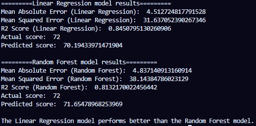
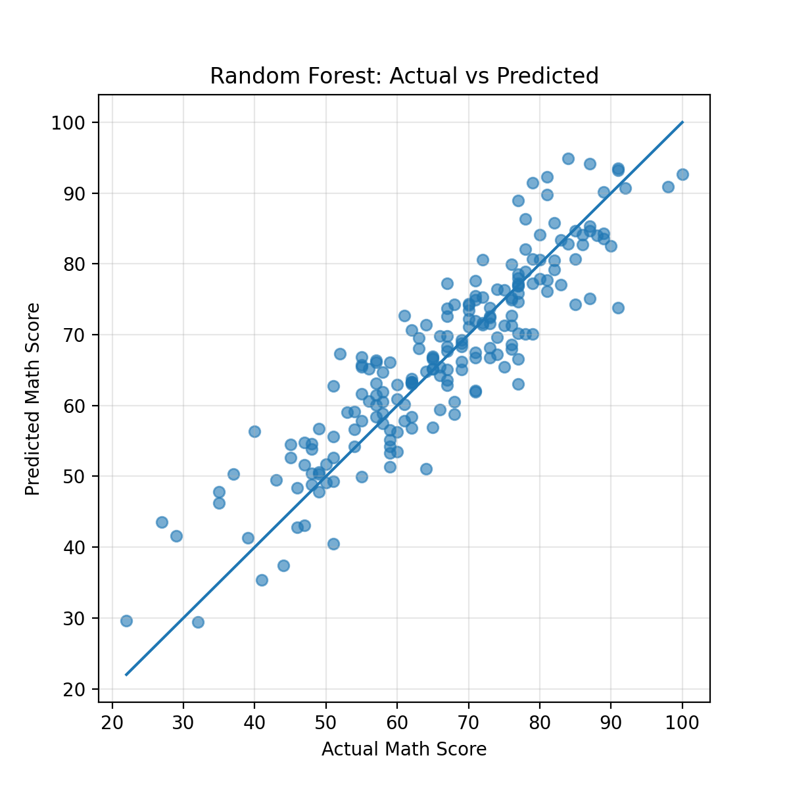

# 🎓 Student Performance Prediction using Machine Learning

This project predicts students’ **math scores** using **Linear Regression** and **Random Forest Regressor** based on features like reading score, writing score, test preparation, lunch type, gender, race/ethnicity, and parental education.  
Both models are compared using **MAE, MSE, and R² Score**, and results are visualized with **Actual vs Predicted** plots.

---

## 📁 Dataset

**Source (Kaggle):**  
https://www.kaggle.com/datasets/spscientist/students-performance-in-exams

Target:
- `math score`

Features:
- reading score, writing score, test preparation course, lunch, gender, race/ethnicity, parental level of education

---

## 🛠️ Tech Stack

- Python
- Pandas
- Matplotlib
- Scikit-learn

---

## 🧠 Workflow

1. Load dataset and select features  
2. Encode categorical variables using one-hot encoding  
3. Split data into train and test sets  
4. Train:
   - Linear Regression
   - Random Forest Regressor (tuned)  
5. Evaluate using MAE, MSE, and R²  
6. Compare models and visualize results  
7. Save plots as images

---

## 📊 Results

- Both models perform well.
- **Linear Regression** achieves better overall performance (lower MAE, higher R²), showing the relationship is mostly linear.
- **Random Forest** is competitive but slightly less accurate on average.

---

## 📸 Output & Visualizations

### Console Output

### Linear Regression: Actual vs Predicted

### Random Forest: Actual vs Predicted

---

## ▶️ How to Run

  pip install pandas matplotlib scikit-learn
  python Student_Performance_Prediction.py
  Make sure StudentsPerformance.csv is in the same folder.

---

## 🎯 What This Project Shows

-Feature encoding and preprocessing
-Regression modeling with scikit-learn
-Model comparison using proper metrics
-Visual analysis with Actual vs Predicted plots
-End-to-end ML workflow on real data

---

👤 Author

  Ayaan Afsar
